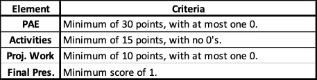

## Syllabus

### Course Description

An introduction to large-scale software development through participation in a Humanitarian Free and Open Source Software (HFOSS) project. Readings and discussions will focus on FOSS and HFOSS philosophy, licensing, communication tools, project and community organization, and software engineering topics related to large-scale software development. Case studies of social, legal and ethical issues raised by computing and computing for the greater good will complement participation in the HFOSS project.

### Prerequisite Knowledge:

This course assumes basic competency in object oriented programming, Linux/Unix command line, version control (git/GitHub), and open source project experience. The nominal prerequisites for this content at Dickinson are COMP 132 - Principles of Object-Oriented Design and COMP 190 - Tools and Techniques for Software Development.

### Course Schedule

Assignment details including due dates and topics are indicated on the Course Home Page:
- https://dickinson-comp-290.github.io/website/

### Textbook

Reading materials for COMP 290 will be provided via links on the course schedule or via Moodle.

### Learning Goals

Students will:
- acquire concepts and skills necessary for large-scale and Free and Open Source Software (FOSS) development including software processes, FOSS philosophy and licensing, community structures and communication mechanisms.
- deepen their understanding of social and ethical issues in computing and appreciation of computing for the greater good.
- [WiD goal] develop their ability to write effectively in the context of a software development team.

### Community and Inclusivity

All members of this class are equally valued members of our course community. The insructor aims to create an *inclusive atmosphere* in which we can listen and speak in ways that are respectful of each other and our diversity of heritages, idedenitites, experiences, knowledge and views. All questions will be accepted and treated with kindness. Some topics will push us to develop new ideas and opinions about things we may not have thought about before. The instructor aims to promote a *generous atmosphere*. One where we listen and speak to understand. One where all are given the benefit of the doubt as they try out new and partially formed thoughts and opinions. One where we respond to and critique statements and ideas, not individuals.  If you feel at any time that these ideals are not being met or have ways that our course atmosphre can be improved you are encouraged to reach out to the instructor.  In cases where talking with the instructor is not comfortable please contact your advisor, the Department Chair or another trusted College offical for guidiance.

### Course Structure

The first part of the course (approximagely 2/3 of the semester) will be devoted to learning web development and onboarding to the FarmData2 project. This part of the course will be run as a fairly typical course with discussions, lectures and assignments. The second part of the course (the final 1/3 of the semester) will be devoted to participating in the FarmData2 project. In this part of the course you will work with a team to contribute bug fixes, features and/or automated tests that are needed by the FarmData2 project.

#### Time Committement

You should allocate 3-4 hours per week outside of class for this course. Some weeks will require less. Others, if you encounter difficulties, may require more. Please allocate enough time in your schedule for work on this course. This is consistent with [Dickinson’s standard](https://www.dickinson.edu/download/downloads/id/10480/academic_policy_and_procedure) that "at least three hours of study accompany each class period".  If you find the activites are taking significantly longer than the expected time, please reach out to your insstructor to discuss strategies for reducing the time required.

#### Readings & Discussions

A short reading on an open source, software engineering or contemporary social/legal/ethical issues in computing will be assigned prior to most class meetings.  The class meeting will begin with a class discussion of that reading. You are expected to do the readings in advance and come to class prepared to contribute to the discussion. Note that while everyone is expected to prepare for every discussion, it is not required that everyone contribute to every discussion. However, you are expected to contribute regularly enough to demonstrate you are preparing and engaging with the materials.  Students who are failing to demonstrate sufficient engagement or participation will be given updates and suggestions for improvement.

**Laptops will be required to be closed during discussions.**

To prepare for class discussions you might:
- Identify the main points made by the reading.
- Think about your position on any controversial or unsettled issues that are raised.
- Note things that you found interesting that you would like to hear your classmates opinions on.
- Prepare questions to ask on things that were unclear to you.

#### Introductory Presentations

Each class will include a short introductory presentation to the day's topic by the instructor.  This introduction is intended to provide a big picture view of the topic and how it fits into the larger context of the course, software development and open source.  They are not intended to provide all of the information that you need to complete the activities.

#### Homework Activities

Following each Introductory Presentation, you will complete a collection of activities that guide you through the development of the main ideas, techniques for solving problems and provide practice with the material.  These activities will start from the introductory material but will also contain additional videos/readings and guide you through the learning of additional new material that builds on the introductory material. 

**Homework activities are due before the next class meeting.**

#### Project Work

Team team project work will consist of the following elements:

* Weekly Team 5-15 Reports: Each team will submit a [5-15 report](https://co2partners.com/515-report-increasing-effectiveness-200-percent/) summmarizing and reflecting on the team's accomplishments, priorites, challenges and lessons learned for the week.
* Weekly Demo: Each class period during the project work period will include time for each team to give a 10-12 minute demonstration of what they have accomplished during the week and to present any challenges they are facing for feedback and discussion.
* Repository Code Commits: Teams are expected to make regular commits of their work. push them to their fork of the project and to make pull requests to the upstream repository as appropriate.
* Final Presentation: Each team will give a 20 minute presentation during the final exam period describing and demonstrating the team's accomplishments, challenges and reflecting on lessons learned.

### Grading

The COMP 290 course is graded as a Credit/No Credit course (see [Dickinson's Academic Policies and Procedures](https://www.dickinson.edu/download/downloads/id/10480/academic_policy_and_procedures.pdf)).  The points below explain how each component of the course is scored and what is required to receive credit for the course as a whole.

#### Participation / Attendance / Engagement (PAE)

You will receive a PAE score for each class meeting using the following rubric:

![PAE Rubric. 3 points - Present; Demonstrates careful and thorough preparation; Highly engaged in class and discussion; Contributing; Asking questions; Participation improved the class for all. 2 points - Present; Demonstrates some preparation Engaged in class and discussion; Actively listening; Possibly making contributions or asking questions. 1 point - Present; Possibly demonstrates a lack of preparation; Possibly not fully or consistently engaged. 0 points - Absent; Actively disengaged (phone/laptop/etc); Possibly distracting to others.](images/PAE-Rubric.jpg)

If you know you will be unable to attend a class due to a [College recognized religious holiday](https://www.dickinson.edu/download/downloads/id/13888/cssj_interfaith_calendar.pdf) or other extenuating circumstances please contact your instructor in advance. If if your request is in line with [College policy](https://www.dickinson.edu/download/downloads/id/12644/religious_accommodations_policy.pdf), reasonable and timely we will make accommodations and provide an alternative means of earning a PAE score for the missed class.  In the case of illness, please contact me as soon as possible (still preferably before class) and again, if reasonable and timely, we will make accommodations and provide an alternative means of earning a PAE score for the missed class.

If you contact the instructor regarding an absense and the instructor judges that the reason for the absence is valid, you may earn a PAE score of 2 for the missed day by submitting (via Teams or e-mail) a 250-400 word summary of your thoughts on the reading(s) that were assigned for the class discussion that was missed.  This summary must be submitted within 1 week of the missed class period, unless otherwise arranged with the instructor.

#### Homework Activities

You will receive a score on each Homework Activity using the following rubric:

![Activity Rubric. 3 points - On time; Complete; Demonstrates a strong understanding and thoughtful engagement; Uses complete sentences; Neat and organized. 2 points - On time or max for a late/resubmission; Complete or nearly complete; Demonstrates a sufficient understanding of the material; Some answers may not fully address the question, be unclear, be insufficiently explained, use incomplete sentences, and/or be messy/disorganized. 1 point - Insufficiently complete; Fails to demonstrate acceptable level of understanding. 0 points - Not submitted or largely incomplete.](images/Activity-Rubric.jpg)

A Homework Activity receiving a score of 1 or 0 may be (re)submitted **once within 1 week** of being returned to the class. An activity (re)submitted within 1 week will be (re)scored and the new score will replace the original.  Late or resubmitted activities will receive a maximum score of 2. (Re)submissions more 1 week after an assignment is returned to the class will not be accepted and the original score will remain.  Extensions beyond 1 week will only be considered in extenuating circumstances with appropriate documentation.  Please see the "Life Happens" section at the bottom of this document.

#### Project Work

You will receive a score each week during the projet work using the following rubric:

![Project Work Rubric. 5-15: 3 points - On time; Complete, clear, and concise; Thoughtful and reflective as well as factual; Accounts for all team member activities. 2 points - On time; Complete and factual; Accounts for all team member activities. 1 point - Late; Incomplete or unclear; Not all team members activities described. 0 points - Very late; Missing or substantially incomplete.  Demos: 3 points - Clearly demonstrates accomplishment;  Shows code and clearly connects code to live demonstration; Individual contributed effectively. 2 points - Clearly demonstrates effort;  Shows code and gives live demonstration; Individual was involved. 1 point - Suggests insufficient effort; Code presentation and/or demonstration are unclear; Individual had minimal participation. 0 points - Demo not given; Clearly insufficient effort invested since prior class; Individual did not participate.  Commits: 3 points - Individual has co-authored commits; Commits reflect cohesive units of work; Commit messages are descriptive; Pull requests made as appropriate. 2 points - Individual has co-authored at least one commit; Commits and commit messages are acceptable. 1 point - Individual has not co-authored any commits. Commits are not cohesive; Commit messages are perfunctory. 0 points - Individual has not co-authored any commits.](images/Project-Rubric.jpg)

You will receive a score for the final project presentation using the following rubric:

![Presentation Rubric. 3 points - Clearly demonstrates accomplishment; Presentation was easy for target audience to follow; Shows code and clearly connects code to live demonstration; Shows thoughtful reflection on experience and learning; Individual contributed effectively. 2 points - Clearly demonstrates effort;  Majority of presentation could be followed by target audience; Shows code and gives live demonstration; Includes comments on experience and learning; Individual was involved. 1 point - Suggests insufficient effort; Significant parts of presentation were difficult for target audience to follow; Code presentation and/or demonstration are unclear; Experience and learning insufficiently addressed; Individual had minimal participation. 0 points - Individual did not participate sufficiently in project work to meaningfully contribute to presentation.](images/Presentation-Rubric.jpg)

#### Receiving Credit for the Course

In order to receive credit for the course you must meet the following criteria:

The instructor reserves the right, with notification to the class, to reduce (but not increase) the point totals required for credit (e.g. in the event of a canceled class or a day with no assigned reading.)

### Academic Integrity

Please take the time to read the Academic Misconduct section of [Dickinson's Community Standards](https://www.dickinson.edu/download/downloads/id/11821/community_standards.pdf). Violations of this policy are considered serious transgressions, so you should be especially certain that you understand your rights and responsibilities under it. Students suspected of academic dishonesty will be subject to the process outlined in the [Student Conduct](http://www.dickinson.edu/homepage/69/student_conduct) pages.

The specific policies for COMP190 are detailed below. If you are unsure about whether or not certain kinds of collaboration or sources are permissible on an assignment or in this course, ask your instructor.

#### Collaboration

Homework Activities and Quizzes in COMP 290 are individual assignments. All work submitted must be your own work. Sharing or receiving of answers to assignments is not permitted.

However, you are encouraged to interact and to help each other learn.  For example:
- You may ask and answer clarifying questions about assignments from your peers.
- You can ask for suggestions of other resources to use or how to proceed with an assignment.  
- You can help each other complete individual questions in the activities, as long as you each do the work individually.
- You can visit evening TA lab hours in Tome 118 and consult the TA.
- Etc.

All of these types of questions can be asked of the instructor or of your classmates, either in person or on the course Teams channel. You are encouraged to ask and respond on the Teams channel. If you ask in person, please also try to post what you learn to the channel. This will ensure that others with the same questions will have access to the same helpful information that you receive.

**What you cannot do is copy answers from someone else. You must complete all question or exercise yourself on your own machine.** It is the process of trying and working through these exercises that builds your experience.  And that experience is what you will need to succeed in future classes, internships and jobs.

####  Outside Sources

There are sites where answers can be looked up or where others can be asked for solutions. There are undoubtedly assignments from past offerings of this course that aree available to some of you. There are calculators and tools that will generate answers to some problems. Regardless of the availability of these materials, **the bottom line is that you are responsible** for ensuring your own mastery of the material. Failure to do so will limit your success in this class, future classes, internships and jobs that rely on this material.

That said, for some problems you will be expected to use web searches and outside sources. In those cases this will be explicitly indicated in the problem.  Otherwise, the expectation is that you should be able to answer the question based on what you already know combined with careful and creative thought and diligent effort. If you struggle with such a question, ask for suggestions (see Collaboration above).

### Intellectual Property Rights

Audio or video recording of class meetings, lectures or discussions is prohibited without explicit permission of the instructor. Photographic records of whiteboards, projected slides or other visual media is also prohibited without explicit permission of the instructor. In any case where audio/video/photographic records are provided or permission is given for them to be made they are for personal use only. They may not be shared or redistributed and must be destroyed at the end of their usefulness or within one week following the termination of this course, whichever comes first. Similarly, any redistribution of sample code, homework solution sets or provided lab code is prohibited. Please note that all outside materials used in the course (readings/tutorials/assignments/projects/etc) are also be governed by their own licensing and copyright agreements.

### Accommodations Students with Disabilities

Dickinson values diverse types of learners and is committed to ensuring that each student is afforded equitable access to participate in all learning experiences. If you have (or think you may have) a learning difference or a disability – including a mental health, medical, or physical impairment – that would hinder your access to learning or demonstrating knowledge in this class, please contact Access and Disability Services (ADS). They will confidentially explain the accommodation request process and the type of documentation that Dean and Director Marni Jones will need to determine your eligibility for reasonable accommodations. To learn more about available supports, go to www.dickinson.edu/ADS, email access@dickinson.edu, call (717)245-1734, or go to the ADS office in Room 005 of Old West, Lower Level (aka "the OWLL").

If you’ve already been granted accommodations at Dickinson, please follow the guidance at www.dickinson.edu/AccessPlan for disclosing the accommodations for which you are eligible and scheduling a meeting with me as soon as possible so that we can discuss your accommodations and finalize your Access Plan. If you will be using any test-taking accommodations in this class, be sure to enter all test dates into your Access Plan in advance of our meeting.

### Accessibility

This class meets and my office are located on the second floor of Tome Hall, which has an elevator, located to the left of the stairs inside the main entrance. If you require the use of an elevator to access our class or my office, please let me know. If there is ever a malfunction with the elevator, we will be notified by email, and I will consult with ADS to identify our options for that day.

### Life Happens:

Sometimes stuff just happens, even more so in the challenging times in we currently find ourselves. Sometimes it is an unexpected sudden event such as an illness or family emergency. Other times it may be an ongoing issue or concern or an accumulation of smaller issues. Any of these things may affect your (or my) ability to focus or perform up to your (or my) potential through no shortcoming or fault of your (or my) own. Dickinson and this course provides a kind and caring community and we want to see you achieve at your full potential. So, if you are experiencing life events that are affecting your performance please don’t hesitate to talk to your instructor, your advisor or a member of the [CARE Team](https://www.dickinson.edu/info/20226/student_life/3540/). They will all be willing to talk with you, help to formulate a plan and/or connect you with others that may be able to assist. That said, it is still always best to contact the instructor in advance if you are going to miss a class meeting or an assignment due date. I will simmilarly communicate toy you any issues that I am facing in advance and we will adapt.
